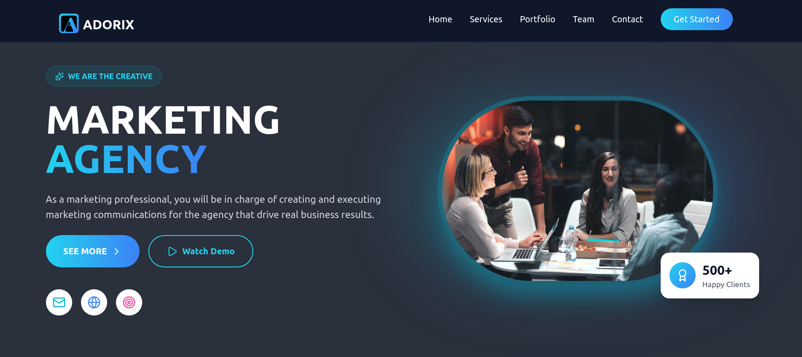

# Adorix Marketing Agency — Landing Page

  
  
  
  
  
  **A simple, clean and responsive **landing page** for a marketing agency, built with **React.js** and **Tailwind CSS**.**
  
  [Live Demo](https://adorix-marketing-agency.vercel.app/) · [Report Bug](https://github.com/electra51/Adorix-marketing-agency/issues) · [Request Feature](https://github.com/electra51/Adorix-marketing-agency/issues)

---

## Preview

  

---

## Core Features

- Built using **React.js** — component-based architecture, easy to maintain and extend.  
- Styled with **Tailwind CSS** for utility-first, responsive and mobile-friendly design.  
- Simple and lightweight — works well for marketing/agency landing pages.  
- Easy to customize: update texts, images, colors, sections as needed. 

---

## Technologies Used

## Contributing

Contributions are always welcome! Here's how you can help:

1. Fork the project
2. Create your feature branch (`git checkout -b feature/AmazingFeature`)
3. Commit your changes (`git commit -m 'Add some AmazingFeature'`)
4. Push to the branch (`git push origin feature/AmazingFeature`)
5. Open a Pull Request

---

## Author

**Electra51**

- **GitHub**: [@Electra51](https://github.com/Electra51)
- **LinkedIn**: https://www.linkedin.com/in/safayet-nur/
- **Email**: safayetnurelectra@gmail.com
- **Portfolio**: https://nextjs-my-portfolio-electra51.vercel.app/
- **Twitter**: https://x.com/nur_safaye51

---

## Support

If you like this project, please ⭐ star this repository!

---

**Star this repository if you found it helpful!**
### Made with ❤️ by Electra51
Happy Coding! 🚀

